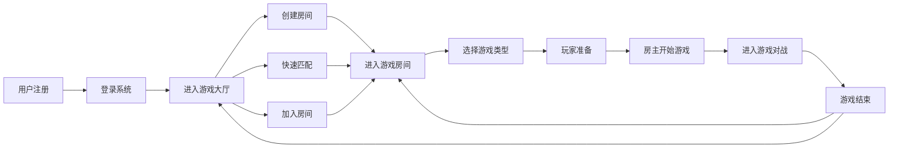

## 1. 产品概述

在线游戏对战平台，支持用户注册登录、在线匹配对手、创建/加入游戏房间、选择多种游戏类型进行实时对战。核心解决用户在线娱乐、社交对战的需求，目标用户为休闲游戏爱好者。

## 2. 核心功能

### 2.1 用户角色
| 角色 | 注册方式 | 核心权限 |
|------|----------|----------|
| 普通用户 | 用户名+密码注册 | 登录、匹配、创建/加入房间、准备、开始游戏、对战 |

### 2.2 功能模块
1. **登录注册页**: 用户注册、用户登录
2. **游戏大厅**: 在线用户列表、快速匹配、房间列表、创建房间
3. **游戏房间**: 玩家列表、准备状态、选择游戏类型、房主开始游戏、聊天
4. **游戏对战**: 扫雷游戏、是男人就上一百层、见缝插针、实时对战状态

### 2.3 页面详情
| 页面名称 | 模块名称 | 功能描述 |
|----------|----------|----------|
| 登录注册页 | 注册模块 | 输入用户名密码，注册新用户 |
| 登录注册页 | 登录模块 | 输入用户名密码，登录系统 |
| 游戏大厅 | 用户信息 | 显示当前用户信息、在线人数 |
| 游戏大厅 | 快速匹配 | 点击自动匹配对手进入房间 |
| 游戏大厅 | 房间列表 | 显示所有开放房间，可加入 |
| 游戏大厅 | 创建房间 | 输入房间名创建新房间 |
| 游戏房间 | 玩家列表 | 显示房间内玩家及其准备状态 |
| 游戏房间 | 游戏选择 | 下拉选择游戏类型（扫雷/100层/见缝插针） |
| 游戏房间 | 准备按钮 | 切换准备/取消准备状态 |
| 游戏房间 | 开始按钮 | 房主在所有人准备后点击开始游戏 |
| 游戏对战 | 游戏容器 | 根据游戏类型加载对应游戏组件 |
| 游戏对战 | 对战状态 | 实时显示双方游戏进度和结果 |

## 3. 核心流程

用户注册 → 登录 → 进入大厅 → 创建房间/快速匹配/加入房间 → 选择游戏类型 → 所有玩家准备 → 房主开始游戏 → 进入对战 → 游戏结束显示结果 → 返回房间/大厅

## 4. 用户界面设计

### 4.1 设计风格
- **主色调**: 深靛蓝色 (#1e3a5f) 作为主色，科技感十足
- **辅助色**: 霓虹青色 (#00d4ff) 作为高亮和强调色，橙红色 (#ff6b35) 用于警告和重要操作
- **按钮风格**: 圆角8px，悬浮时有发光效果和微缩放动画
- **字体**: 标题使用 'Orbitron' 科幻字体，正文使用 'Rajdhani' 现代无衬线字体
- **布局风格**: 卡片式布局，毛玻璃背景效果，深色主题
- **图标风格**: 使用 lucide-react 线性图标，搭配霓虹色发光效果

### 4.2 页面设计概述
| 页面名称 | 模块名称 | UI元素 |
|----------|----------|----------|
| 登录注册页 | 整体布局 | 居中卡片，渐变背景，霓虹边框动画，悬浮入场动画 |
| 游戏大厅 | 顶部导航 | 用户信息卡片，在线人数显示，登出按钮 |
| 游戏大厅 | 房间列表 | 网格布局卡片，显示房间名、游戏类型、人数、状态 |
| 游戏大厅 | 操作区 | 大号主按钮，发光悬停效果 |
| 游戏房间 | 玩家列表 | 玩家头像卡片，准备状态指示器（绿色发光边框） |
| 游戏房间 | 游戏选择 | 自定义下拉选择器，游戏图标预览 |
| 游戏对战 | 游戏区域 | 居中游戏画布，双方状态栏，实时分数显示 |

### 4.3 响应性
- Desktop-first 设计，主内容区固定最大宽度1280px
- 移动端适配：房间列表改为单列，按钮尺寸放大
- 触摸优化：所有可点击元素最小44x44px

### 4.4 3D场景指导
本项目不涉及3D场景。
