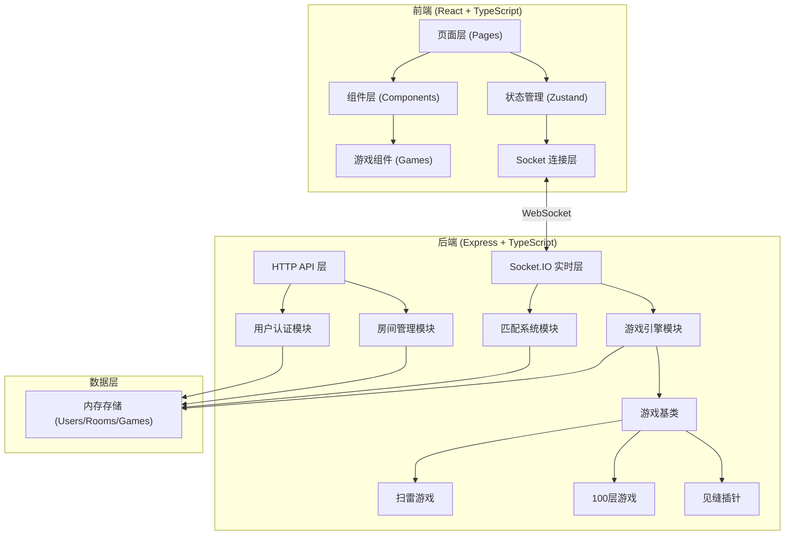
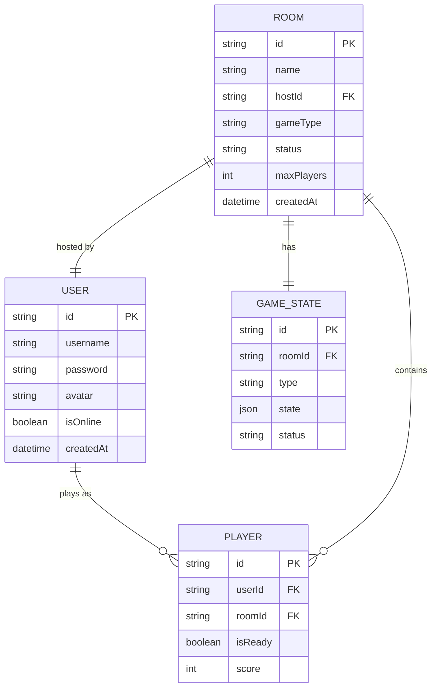

## 1. 架构设计



## 2. 技术描述
- **前端**: React@18 + TypeScript + TailwindCSS@3 + Vite + Zustand + Socket.IO-client + lucide-react
- **后端**: Express@4 + TypeScript + Socket.IO + CORS
- **实时通信**: Socket.IO 用于房间同步、游戏状态同步、匹配通知
- **数据存储**: 内存存储（开发阶段），可扩展为 Redis 或数据库
- **初始化工具**: vite-init (react-express-ts 模板)

## 3. 目录结构
```
project/
├── shared/                     # 前后端共享类型
│   └── types.ts
├── api/                        # 后端代码
│   ├── index.ts                # 入口文件
│   ├── types.ts                # 后端类型
│   ├── modules/
│   │   ├── auth/               # 用户认证模块
│   │   ├── room/               # 房间管理模块
│   │   ├── matching/           # 匹配系统模块
│   │   └── games/              # 游戏引擎模块
│   │       ├── GameBase.ts     # 游戏基类
│   │       ├── GameFactory.ts  # 游戏工厂
│   │       ├── Minesweeper.ts  # 扫雷
│   │       ├── Climb100.ts     # 是男人就上一百层
│   │       └── Needle.ts       # 见缝插针
│   └── socket/
│       └── handler.ts          # Socket.IO 事件处理
├── src/                        # 前端代码
│   ├── main.tsx
│   ├── App.tsx
│   ├── types.ts
│   ├── pages/
│   │   ├── Login.tsx
│   │   ├── Lobby.tsx
│   │   ├── Room.tsx
│   │   └── GameArena.tsx
│   ├── components/
│   │   ├── RoomCard.tsx
│   │   ├── PlayerCard.tsx
│   │   └── GameSelector.tsx
│   ├── games/                  # 前端游戏组件
│   │   ├── GameContainer.tsx   # 游戏容器
│   │   ├── MinesweeperGame.tsx
│   │   ├── Climb100Game.tsx
│   │   └── NeedleGame.tsx
│   ├── store/
│   │   └── useGameStore.ts     # Zustand 状态管理
│   ├── socket/
│   │   └── client.ts           # Socket 客户端
│   └── utils/
```

## 4. 路由定义
| 路由 | 用途 |
|------|------|
| /login | 登录注册页面 |
| /lobby | 游戏大厅 |
| /room/:roomId | 游戏房间 |
| /game/:roomId | 游戏对战 |

## 5. API 定义

### HTTP API (REST)
```typescript
// 用户注册
POST /api/auth/register
Request: { username: string; password: string }
Response: { success: boolean; user: User; token: string }

// 用户登录
POST /api/auth/login
Request: { username: string; password: string }
Response: { success: boolean; user: User; token: string }

// 获取房间列表
GET /api/rooms
Response: { rooms: Room[] }

// 创建房间
POST /api/rooms
Request: { name: string; gameType: GameType }
Response: { success: boolean; room: Room }
```

### Socket.IO 事件
```typescript
// 客户端发送
'join_room'     (roomId: string, userId: string)
'leave_room'    (roomId: string, userId: string)
'ready'         (roomId: string, userId: string, isReady: boolean)
'start_game'    (roomId: string, userId: string)
'game_action'   (roomId: string, userId: string, action: GameAction)
'quick_match'   (userId: string, gameType: GameType)
'cancel_match'  (userId: string)

// 服务端发送
'room_updated'  (room: Room)
'player_joined' (player: Player)
'player_left'   (userId: string)
'player_ready'  (userId: string, isReady: boolean)
'game_started'  (gameState: GameState)
'game_updated'  (gameState: GameState)
'game_over'     (result: GameResult)
'match_found'   (room: Room)
'error'         (message: string)
```

## 6. 数据模型

### 6.1 数据模型定义


### 6.2 核心类型定义
```typescript
// shared/types.ts

type GameType = 'minesweeper' | 'climb100' | 'needle';

type RoomStatus = 'waiting' | 'playing' | 'finished';

type GameStatus = 'waiting' | 'playing' | 'paused' | 'finished';

interface User {
  id: string;
  username: string;
  avatar: string;
  isOnline: boolean;
}

interface Player {
  userId: string;
  username: string;
  avatar: string;
  isReady: boolean;
  score: number;
  isHost: boolean;
}

interface Room {
  id: string;
  name: string;
  hostId: string;
  gameType: GameType;
  status: RoomStatus;
  players: Player[];
  maxPlayers: number;
  createdAt: number;
}

interface GameState {
  roomId: string;
  gameType: GameType;
  status: GameStatus;
  players: { [userId: string]: any };
  winner: string | null;
}

interface GameAction {
  type: string;
  payload: any;
}

interface GameResult {
  roomId: string;
  winnerId: string;
  winnerUsername: string;
  scores: { [userId: string]: number };
}
```

## 7. 游戏引擎架构

### 7.1 游戏基类设计
```typescript
// 所有游戏必须继承此基类
abstract class GameBase {
  protected roomId: string;
  protected players: string[];
  protected gameState: any;
  
  constructor(roomId: string, players: string[]);
  abstract init(): void;
  abstract handleAction(userId: string, action: GameAction): void;
  abstract getState(): GameState;
  abstract checkGameOver(): boolean;
  abstract getWinner(): string | null;
  abstract getScores(): { [userId: string]: number };
}
```

### 7.2 游戏工厂
```typescript
// 通过工厂模式创建游戏实例，便于扩展
class GameFactory {
  static createGame(type: GameType, roomId: string, players: string[]): GameBase;
  static registerGame(type: string, gameClass: new (...args: any[]) => GameBase): void;
}
```

### 7.3 扩展新游戏的步骤
1. 在 `api/modules/games/` 创建新游戏类，继承 `GameBase`
2. 在 `GameFactory` 中注册新游戏类型
3. 在 `src/games/` 创建对应的前端游戏组件
4. 在 `GameContainer` 中添加游戏类型映射
5. 在 `shared/types.ts` 中添加新的 `GameType` 枚举值
